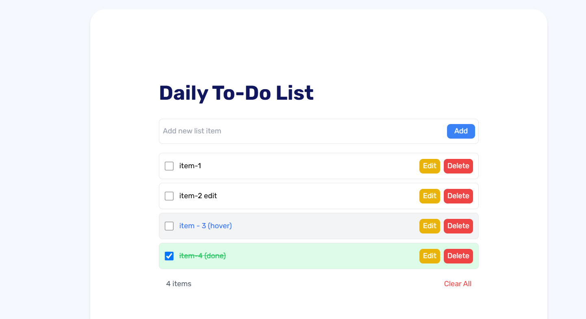

# To-Do App

This is a simple To-Do application built with Vite and React.
[View the live application here](https://todolist103.netlify.app/)

## Intial design of the application.


## The design similarity with the Figma template.



## Features

- Add new tasks
- Edit existing tasks
- Mark tasks as completed
- Delete tasks
- Clear all tasks

## Getting Started

### Prerequisites

Make sure you have Node.js and npm installed on your machine.

### Installation

1. Clone the repository:

  ```bash
     git clone https://github.com/your-username/vite-react-todo-app.git
  ```
2. Navigate to the project directory:

  ```bash
     cd vite-react-todo-app
  ```
3. Install the dependencies:
  ```bash
     npm install
  ```
4. Run the app
  ```bash
     npm run dev
  ```
### The app will be available at http://localhost:3000.   


